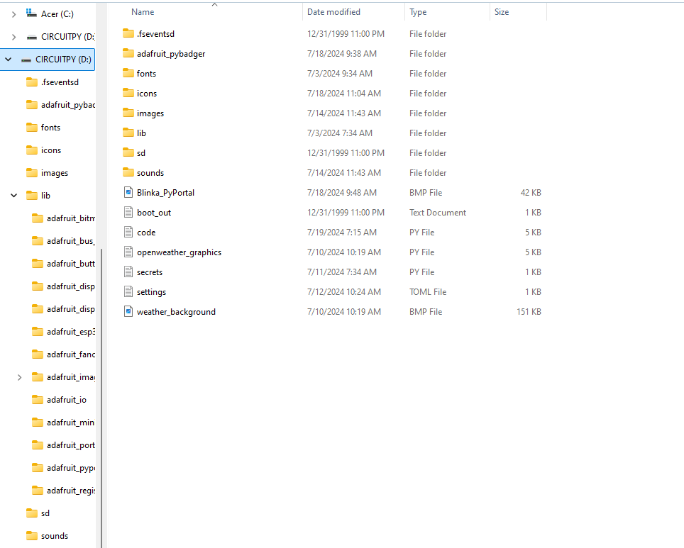

# PyPortal Air Quality Display
My original project was the air quality display on the pyportal, but on top of that I decided to add another project, a weather station that displays the tempurature and the weather conditions in a certain city.  To integrate the two together I utilyzed the pyportal's touchscreen functionality to make an interface that switches between the two.  Over the course of the project I made many mistakes and learned a ton, but if I had to pick one take away from this experience, it would be that I need to slow down sometimes and look at things objectively before assuming the worst and panicking.


| **Engineer** | **School** | **Area of Interest** | **Grade** |
|:--:|:--:|:--:|:--:|
| Zachary M. | Willow Glen High School | Electrical Engineering | Incoming Senior


  
# Final Milestone

<iframe width="560" height="315" src="https://www.youtube.com/embed/0-ahBi9vbWI?si=x4y5XajQcCOr4KBx" title="YouTube video player" frameborder="0" allow="accelerometer; autoplay; clipboard-write; encrypted-media; gyroscope; picture-in-picture; web-share" referrerpolicy="strict-origin-when-cross-origin" allowfullscreen></iframe>

For my final milestone I worked on the touchscreen interface to integrate the two projects with one another.  Originally I was going to try to use the "Making a PyPortal User Interface with DisplayIO" project to display the two projects.  I thought it would work since the example of this project had three different screens with different displays on them, and I thought that I would be able to just make two of the screens the displays from the first two projects.  However, when trying to figure out the code, there were several issues, first of all several parts of the code were trying to access the wifi at the same time and the pyportal couldn't handle that.  Another issue was when I would try to run the display with the air quality code in it, the actual touchscreen wouldn't function at all, which I still have no idea why that was the case.  So eventually, I scrapped using that code as the base and tried to find another way to switch screens.  Then I found the PyBadger event badge code, which switches between three screens when you tap the pyportal anywhere.  I wanted to try this out, so I used it as a base and imported the code from both the weather and air quality projects.  The way the code works is that there are three displays and by touching the screen, the display flips between them.  Originally the second and third displays were for your name and email address, but I used code that constructs a URL with the necessary parameters and sends a GET request to the respective API for each project. It then extracts the data, being the AQI, tempurature and weather conditions, from the JSON response and displays it on the badge in each respective display.


# Second Milestone

<iframe width="560" height="315" src="https://www.youtube.com/embed/PbvK0-TP87c?si=uLyuyqo_LxeEn3MT" title="YouTube video player" frameborder="0" allow="accelerometer; autoplay; clipboard-write; encrypted-media; gyroscope; picture-in-picture; web-share" referrerpolicy="strict-origin-when-cross-origin" allowfullscreen></iframe>

For my second milestone I decided to add another project on top of my baseline air quality display.  The project I decided to add was the weather station from adafruit since I thought it went hand in hand with the air quality display.  The weather station was much easier to setup than the first project since I already had the libraries installed from the air quality display, I had one error which was quickly resovled when I realized I was missing a library nessecary for the code to run.  For the setup I simply took the example code from the adafruit website walkthrough and put it in my code.py file then imported the one additional library into the lib folder on top of the files from the air quality display.  Also halfway through this milestone I recieved the pieces for the case for my pyportal.  The case was relatively easy to assemble since there was only three pieces.  The first step was to put the back cover over the exposed circuit board on the pyportal, then there was a bracket that screwed into the back cover to keep the pyportal in place.  Finally there was a front cover that snapped into place finishing the case.  In my next milestone I plan to use the touchscreen functionality on the pyportal display in order to make an interface that allows a user to switch between the two projects by touching the screen.  

# First Milestone

<iframe width="560" height="315" src="https://www.youtube.com/embed/5C1-feZRntU?si=YvZGG8rAJ5RYRKii" title="YouTube video player" frameborder="0" allow="accelerometer; autoplay; clipboard-write; encrypted-media; gyroscope; picture-in-picture; web-share" referrerpolicy="strict-origin-when-cross-origin" allowfullscreen></iframe>

For my first milestone I made certain the air quality display on the PyPortal was working.  The first step in this was to connect the PyPortal to my computer and download all of the correct libraries into the CIRCUITPY file on my computer.  The next step was for me to connect the PyPortal display to my wifi by using the example code on the adafruit website.  This was the first issue I had since the PyPortal was displaying "AttributeError: 'dict' object has no attribute 'ssid'" , it turns out there was another library that was nessecary to the project that was not shown on the website.  The issue was that I was missing that library.  Finally, I had to input the zip code for my area and the air quality should be displayed.  The issue was that the PyPortal was not showing anything on it's screen and the serial console was displaying "Reply is OK! Response is -1" which is not a valid number for air quality.  The fix to this problem was a little easier, because it turns out my zipcode did not have data from the Air Quality Index used by the code from adafruit, so I changed the zipcode to the nearest one with data.  My plan for the future is to incorporate additional code to change the display and to assemble a magnetic case for the pyportal.

# Schematics
This project was almost all software so I didn't have to assemble anything, so this is just an image of the back of the pyportal that I used to display the code.


# Code
Libraries Necessary


```c++
import os
import adafruit_connection_manager
import board
import busio
from adafruit_esp32spi import adafruit_esp32spi
from digitalio import DigitalInOut
import adafruit_requests
import adafruit_touchscreen
from adafruit_pybadger import pybadger

# Get WiFi details, ensure these are setup in settings.toml
ssid = os.getenv("CIRCUITPY_WIFI_SSID")
password = os.getenv("CIRCUITPY_WIFI_PASSWORD")

# If you are using a board with pre-defined ESP32 Pins:
esp32_cs = DigitalInOut(board.ESP_CS)
esp32_ready = DigitalInOut(board.ESP_BUSY)
esp32_reset = DigitalInOut(board.ESP_RESET)

spi = busio.SPI(board.SCK, board.MOSI, board.MISO)
radio = adafruit_esp32spi.ESP_SPIcontrol(spi, esp32_cs, esp32_ready, esp32_reset)
print("Connecting to AP...")
while not radio.is_connected:
    try:
        radio.connect_AP(ssid, password)
    except RuntimeError as e:
        print("could not connect to AP, retrying: ", e)
        continue
print("Connected to", str(radio.ssid, "utf-8"), "\tRSSI:", radio.rssi)

# Initialize a requests session
pool = adafruit_connection_manager.get_radio_socketpool(radio)
ssl_context = adafruit_connection_manager.get_radio_ssl_context(radio)
requests = adafruit_requests.Session(pool, ssl_context)

# These pins are used as both analog and digital! XL, XR and YU must be analog
# and digital capable. YD just need to be digital
ts = adafruit_touchscreen.Touchscreen(
    board.TOUCH_XL,
    board.TOUCH_XR,
    board.TOUCH_YD,
    board.TOUCH_YU,
    calibration=((5200, 59000), (5800, 57000)),
    size=(320, 240),
)

def center_text(text, width):
    return text.center(width)

badge_width = 20

pybadger.show_badge(
    name_string=center_text("Zach", badge_width),
    hello_string=center_text("Hello there!", badge_width),
    my_name_is_string=center_text("I am", badge_width),
    hello_scale=2,
    my_name_is_scale=2,
    name_scale=3
)

cur_example = 0
prev_touch = None
while True:
    p = ts.touch_point
    if p and not prev_touch:
        cur_example += 1
        if cur_example >= 3:
            cur_example = 0
        print(cur_example)
    prev_touch = p

    if cur_example == 0:
        pybadger.show_business_card(
            image_name="Blinka_PyPortal.bmp",
            name_string=center_text("Air Quality and Weather", badge_width),
            name_scale=2,
            email_string_one=center_text("By", badge_width),
            email_string_two=center_text("Zachary Maxson", badge_width),
        )
    elif cur_example == 1:
        zip_code = "90210"
        JSON_GET_URL = f"http://www.airnowapi.org/aq/forecast/zipCode/?format=application/json&zipCode={zip_code}&API_KEY=3C7439CE-B94E-42A1-B208-8E3BC4E5A9F8"

        # Define a custom header as a dict.
        headers = {"user-agent": "blinka/1.0.0"}

        print("Fetching JSON data from %s..." % JSON_GET_URL)
        with requests.get(JSON_GET_URL, headers=headers) as response:
            print("-" * 60)
            json_data = response.json()
            AQI = json_data[1]["AQI"]
            print(AQI)
            Value = "AQI: " + str(AQI)
            pybadger.show_badge(
                name_string=center_text(Value, badge_width),
                hello_string=center_text(f"Air Quality Index for", badge_width),
                my_name_is_string=center_text(zip_code, badge_width),
                hello_scale=2,
                my_name_is_scale=2,
                name_scale=3
            )

    elif cur_example == 2:
        LOC = "San Diego, US"
        JSON_GET_URL = f"http://api.openweathermap.org/data/2.5/weather?q={LOC}&appid=f8a3c07d5451203ad807ec226238dc91"

        # Define a custom header as a dict.
        headers = {"user-agent": "blinka/1.0.0"}

        print("Fetching JSON data from %s..." % JSON_GET_URL)
        with requests.get(JSON_GET_URL, headers=headers) as response:
            print("-" * 60)
            json_data = response.json()
            Temp = json_data["main"]["temp"]
            Clouds = json_data["weather"][0]["description"]
            TempF = (Temp - 273.15) * 9 / 5 + 32
            print("Temperature:", TempF)
            print("Description:", Clouds)
            AIR = str(round(TempF, 1))  # Rounded to 1 decimal place

            # Center the SKY text
            max_length = 20
            SKY = Clouds.center(max_length)

            city, country = LOC.split(", ")
            pybadger.show_badge(
    name_string=center_text("Temp: " + AIR + "F", badge_width) + "\n" + center_text(SKY, badge_width),
    hello_string=center_text(f"Weather Status for", badge_width),
    my_name_is_string=center_text(f"{city}, {country}", badge_width),
    hello_scale=2,
    my_name_is_scale=2,
    name_scale=3
)
```

# Bill of Materials

| **Part** | **Note** | **Price** | **Link** |
|:--:|:--:|:--:|:--:|
| Pyportal | Display Screen for Project | $54.95 | <a href="https://www.adafruit.com/product/4116"> <a/> |
| Power Supply | To Provide Power to PyPortal | $7.95 | https://www.adafruit.com/product/1994 |
| MicroUSB Cable | To Connect PyPortal to Computer | $2.95 |  https://www.adafruit.com/product/592 |
| Micro SD Card | Extra Storage | $19.99 |  https://www.adafruit.com/product/2693 |
| Black Nylon Machine Screw and Stand-off Set – M2.5 Thread | For Screwing the Case Together | $16.95 |  https://www.adafruit.com/product/3299 |
| Pyportal 3d Printed Case | Case for Pyportal | $16.29 | https://crowdcraft.io/ |
